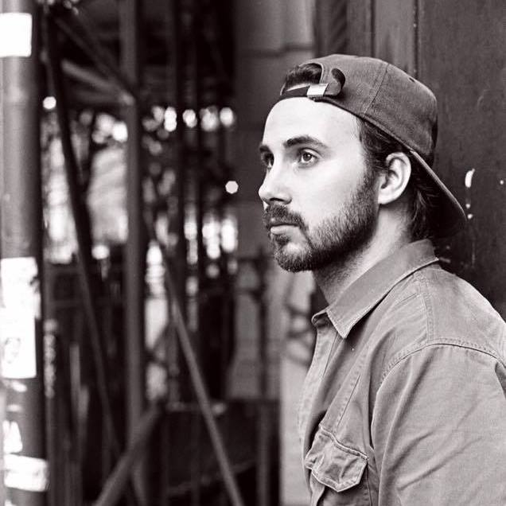

#*KIM KÖHLER/KOEHLER
------------------------------

------------------------------
###About me:

My name is Kim, I am 26 years old. Born and raised in Stockholm, Sweden. I love to play soccer, ski, sail and listen to music. I am currently a junior in the BFA D&T major, also taking a minor in Communication Design and take as much interesting courses as possible.
------------------------------
###What I want to gain from this course:

I want to learn and understand how to achieve the idea i have in my head using code, so far my generative art has only been me tweaking other's code and see what happens. Being able to make computer art/generative art, wether it is design or artwise is something I really want to learn.